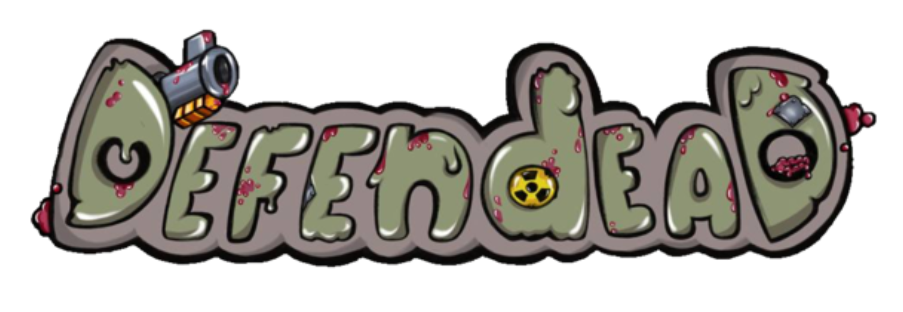

# Tower defence game on Unity

  

## Project Description: 
Defendead is a open source zombie themed Tower Defense game, where players must defend the shelter against waves of attacking zombies using different types of defensive towers. 

## Demo: 

## How to use: 
Players must strategically place their defensive towers along the path of the oncoming zombies to stop them from reaching their destination(shelter). They can also upgrade their towers to increase their chances to survive.

## Features: 
- Three different types of defensive towers (for each attacking zombie type)
- Regular, invisible, and armored zombies with unique abilities 
- Tower upgrading system
- 2 maps
- Wave-based gameplay with increasing difficulty
- Shop with towers
- In battle/game coins
- Statistics
- Settings menu 

## Project Installation / Deployment

**To download game to your mashine:**
1) Download [this](MVP2.app.zip) zip-archive
2) Extract it, you will get the .app file
3) Run it and enjoy the game 

**To play on Web:**
1) Follow the [link](https://slant14.itch.io/tower-defense) to open deployed version
2) Wait the loading time and enjoy the game

## Frameworks and technology:
 - **Unity** game engine for game development, 
 - Scripting in **C#** for game logic

## License
This project is licensed under the **MIT License** - see the [LICENSE](LICENSE) file for details.